# Flo

[](https://ci.appveyor.com/project/benfoster/flo) [](https://travis-ci.org/benfoster/Flo) [](https://www.nuget.org/packages/Flo)

Flo is a lightweight library for composing chain of responsibility pipelines. The inspiration for this project came from the need to break down a large codebase of tightly coupled behavior into smaller units for better extensibility and testability.

Flo works in a similar way to middleware in ASP.NET Core with a focus on immutability and support for handlers that output a different type i.e. `Func<Tin, Func<TOut>`.

## Where can I get it?

Flo is available on [NuGet](https://www.nuget.org/packages/Flo) and targets NetStandard 1.3.

## Usage

To create a pipeline similar to ASP.NET Core's middleware, first define the type you wish to pass between your chain of handlers:

```c#
public class HttpContext
{
    public HttpRequest Request { get;set; }
    public HttpResponse Response { get;set; }
}
```

Use `Pipeline.Build<T>` to create a pipeline passing in a configuration with the handlers you wish to add. Handlers can be delegates or strongly typed (see below). The `Build` method returns a `Func<T, Task<T>` or `Func<TIn, Func<Task<TOut>>` that can safely be reused in your application.

```c#
var pipeline = Pipeline.Build<HttpContext>(cfg =>
    cfg.Add((ctx, next) => { // Handler 1
        Log.Logger.Info("Starting request to {path}", ctx.Request.Path);
        return next.Invoke(context);
    })
    .Add((ctx, next) => { // Handler 2
        if (!Validator.Validate(ctx.Request)) 
        {
            await ctx.Response.WriteAsync("invalid");
            return ctx;
        }
        
        return next.Invoke(context);
    })
    .Add((ctx, next) => { // Handler 3
        await ctx.Response.WriteAsync("Hello World");
        return ctx;
    })
);

var context = new HttpContext { Path = "/foo" };
context = await pipeline.Invoke(context);
```


### Strongly typed handlers

Flo supports strongly typed handlers. To create a strongly typed handler, implement `IHandler<T>` or `IHandler<TIn, TOut>` depending on the type of pipeline you wish to build:

```c#
public class MerchantValidator : IHandler<RequestPayment, ValidationResult>
{
    public async Task<ValidationResult> HandleAsync(
        RequestPayment command, 
        Func<RequestPayment, Task<ValidationResult>> next)
    {
        if (command.MerchantId <= 0)
            return new ValidationResult
            {
                ErrorCode = "merchant_invalid"
            };
        
        return await next.Invoke(command);
    }
}
```

Strongly typed handlers are registered in the same way as delegate handlers:

```c#
public static Func<RequestPayment, Task<ValidationResult>> Build()
{
    return Pipeline.Build<RequestPayment, ValidationResult>(cfg =>
        cfg.Add<MerchantValidator>()
        .Final(s => Task.FromResult(new ValidationResult { IsValid = true }))
    );
}
```

### Final Handlers 

There are some differences between how the final handler is _handled_ with `Pipeline<T>` and `Pipeline<TIn, TOut>`.

For `Pipeline<T>` you do not need to do anything to mark the final handler as Flo will automatically feed the output your final handler into the input of the previous one, on the way back out. You can therefore safely call `next.Invoke` on your final handler without issue, for example:

```c#
var pipeline = Pipeline.Build<TestContext>(cfg =>
    cfg.Add((ctx, next) => {
        ctx.Add("Item1", "Item1Value");
        return next.Invoke(ctx);
    })
    .Add((ctx, next) => {
        ctx.Add("Item2", "Item2Value");
        return next.Invoke(ctx); // no issue
    })
);
```

With `Pipeline<TIn, TOut>` Flo can't automatically feed the final handler result into the previous handler so you should _not_ call `next.Invoke` on the final handler, for example:

```c#
var pipeline = Pipeline.Build<string, int>(cfg =>
    cfg.Add((input, next) => {
        input += "hello";
        return next.Invoke(input);
    })
    .Add((input, next) => {
        input += " world";
        return next.Invoke(input);
    })
    .Add((input, next) => {
        return Task.FromResult(input.Length); // don't call next
    })
);
```

If you do, `default(TOut)` will be returned. A convenience method `Final` is also available on both pipeline types, to make this declaration more explicit:

```c#
var pipeline = Pipeline.Build<string, int>(cfg =>
    cfg.Add((input, next) => {
        input += "hello";
        return next.Invoke(input);
    })
    .Add((input, next) => {
        input += " world";
        return next.Invoke(input);
    })
    .Final(input => {
        return Task.FromResult(input.Length); 
    })
);
```

### When

`When` allows you to branch the pipeline based on a predicate, for example:

```c#
return Pipeline.Build<RequestPayment, PaymentResponse>(cfg =>
     cfg
        .Add<PaymentValidationHandler>() 
        .When(command => command.Is3ds, inner => 
            inner.Add<ThreeDsLoggingHandler>() 
            inner.Add<ThreeDsHandler>() 
        )
        .Add<ProcessingHandler>() 
);
```

You can add multiple handlers to the branched pipeline. For `Pipeline<T>` the parent pipeline will automatically continue after the inner (when) pipeline has completed. The above example would have the following order of execution:

1. `PaymentValidationHandler`
2. `ThreeDsLoggingHandler`
3. `ThreeDsHandler`
4. `ProcessingHandler`


The response is returned in the reverse order of execution.

For `Pipeline<TIn, TOut>` we will only continue the parent pipeline if the inner pipeline does not return a result (`null`), for example:

```c#
var pipeline = Pipeline.Build<TestContext, TestContext>(cfg =>
    cfg.When(input => true,
        builder => builder.Add((ctx, next) =>
        {
            return Task.FromResult(default(TestContext));
        })
    )
    .Final(ctx => {
        ctx.Add("Test", "TestValue");
        return Task.FromResult(ctx);
    })
);

var result = await pipeline.Invoke(new TestContext());
result.ShouldContainKey("Test");
```

Since the inner handler returned `null` we assume that we should continue on to the parent. This behavior can be changed by overriding the _continuation function_.

### Fork

`Fork` can also be used to branch/fork the pipeline. It differs from `When` in that we never continue to the parent. In the example above, using `Fork` instead of `When` would yield the following order of execution (`ProcessingHandler` is not executed):

1. `PaymentValidationHandler`
2. `ThreeDsLoggingHandler`
3. `ThreeDsHandler`



### Using an IoC Container 

By default Flo uses `Activator.CreateInstance` to create instances of your strongly typed handlers. You can either override this by specifying a `Func<Type, object>` when you configure the pipeline:

```c#
var pipeline = Pipeline.Build<string, string>(cfg =>
    cfg.Add<OverridingHandler>()
    ,type => container.TryGetInstance(type) // use StructureMap container
); 
```

Alternatively you can provide a `Func<THandler>`:

```c#
var pipeline = Pipeline.Build<string, int>(cfg =>
    cfg.Add(() => new StringLengthCountHandler())
);

All strongly typed handlers are lazily initialised to avoid unecessary overhead if a path in the pipeline is not hit.
```

## More examples

You can find more examples in the tests project. I've also started working on a more comprehensive example that demonstrates breaking up a payment gateway into pipelines [here](https://github.com/benfoster/Flo/tree/sample).
